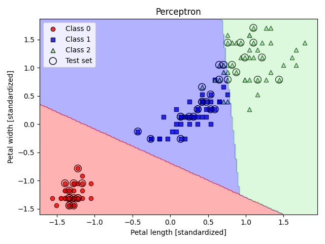
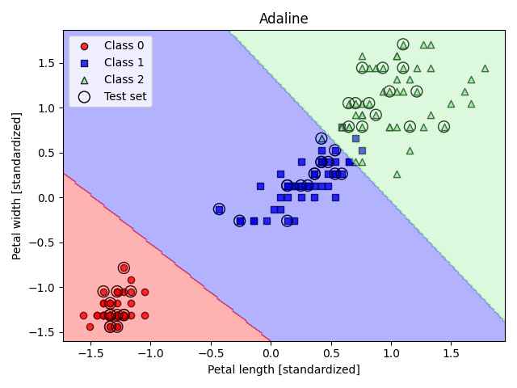
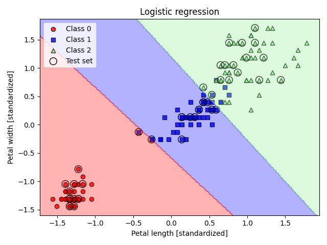
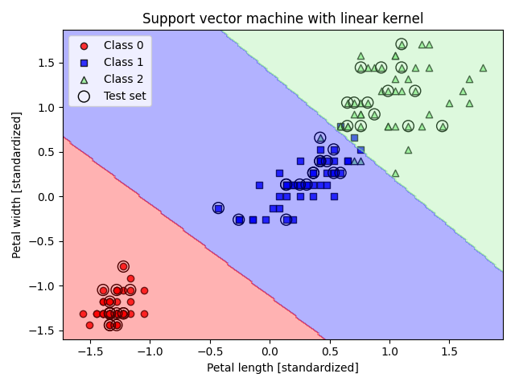
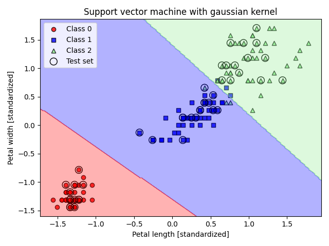
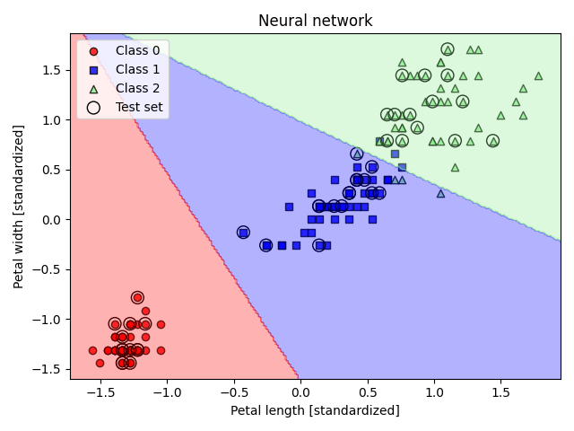

# Machine Learning Classifiers from Scratch
Code for my exam "Computational Methods of Physics". This project implements **several machine learning classifiers** from scratch (no `sklearn` classifiers, only dataset utilities)
1. **Perceptron**;
2. **Adaline (Adaptive Linear Neuron)**;
3. **Logistic Regression**;
4. **Support Vector Machine**
   - Linear kernel;
   - Gaussian (RBF) kernel;
5. **Neural Network**.
The program is not optimized and for more than 1000 epochs is very slow, because the goal is to understand the inner workings of classic ML algorithms by coding them manually and visualizing their decision boundaries.  

Each classifier is trained in a **one-vs-all** setting for multiclass classification and visualized on a 2D projection.

---

## Dataset
The code uses the **Iris dataset** from `sklearn.datasets`, restricted to **petal length** and **petal width** for easy visualization in 2D.  

- 150 samples  
- 3 classes (Setosa, Versicolor, Virginica)  
- Standardized features  

---

## Dependencies
 - Python 3.8+
 - numpy
 - pandas
 - matplotlib
 - scikit-learn (for dataset only)
 - cvxopt (for quadratic programming in SVM)

Install them with:
```bash
pip3 install numpy pandas matplotlib scikit-learn cvxopt
```

---

## Usage
Clone the repository and run:

```bash
python3 main.py
```

You will be prompted to select a classifier:
```
1. Perceptron
2. Adaline
3. Logistic Regression
4. Support Vector Machine (linear kernel)
5. Support Vector Machine (gaussian kernel)
6. Neural Network
Select a classifier:
```

Example output:
```
Misclassified Test Samples: 3 / 45
```

--- 

## Results
### Peceptron


```
Misclassified Test Samples: 5  /  45
```

### Adaline


```
Misclassified Test Samples: 1  /  45
```

### Linear regression


```
Misclassified Test Samples: 2  /  45
```

### Support vector machine 
#### Linear 


```
Misclassified Test Samples: 1  /  45
```

#### Gaussian


```
Misclassified Test Samples: 1  /  45
```

### Neural network


```
Misclassified Test Samples: 1  /  45
```
